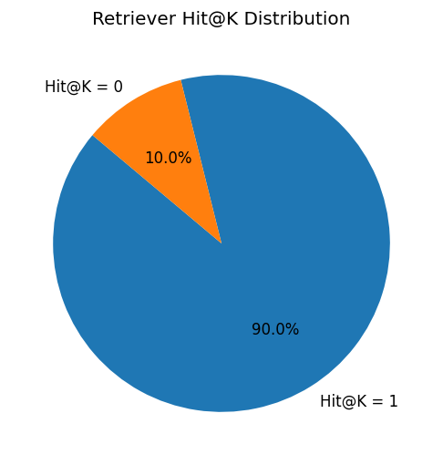

# 📘 Retriever Evaluation

This document explains the purpose, usage, structure, and output of the **Retriever Evaluation** module in `Part_2`.

---

# 🎯 Purpose

The retriever is responsible for finding the correct **HTML knowledge-base snippet** for a user query.

This evaluation script checks:

* Whether the retriever returns the correct HTML `#anchors` (URIs)
* How well it ranks the correct result
* Overall reliability across multiple test cases

Metrics included:

* **Hit@K**
* **MRR (Mean Reciprocal Rank)**
* Per-case retrieved URIs vs expected

The evaluation helps validate the quality of your retrieval system before integrating it with the LLM.

---

# ▶️ How to Run

Run this from the **repository root**:

```bash
python -m Part_2.evaluation.eval_retriever --cases Part_2/evaluation/retriever_cases.json
```

---

# 📦 Output Files

After running, the script produces:

### **`retriever_eval.csv`**

Contains:

* `case_id`
* `expected_uris`
* `retrieved_uris`
* `hit_at_k`
* `mrr`

### **`retriever_pie.png`**

A pie-chart showing:

* % of cases where the correct URI was retrieved
* % of misses

---

---


# 🧪 Case File Format (`retriever_cases.json`)

Each item in the JSON contains:

```json
{
  "id": "unique_case_id",
  "query": "user natural-language query",
  "hmo": "optional — MACCABI | CLALIT | MEUHEDET",
  "tier": "optional — GOLD | SILVER | BRONZE",
  "expected_uris": ["filename.html#anchor"]
}
```

**Notes:**

* `expected_uris` *must* include the full KB filename + `#tX_Y` anchor.
* `hmo` and `tier` help the retriever narrow context, but are optional.

---

# ⚙️ How It Works

1. **Load the JSON case list**
2. **Initialize the embedding model + HtmlKB loader**
3. For each case:

   * Run `kb.search(query, hmo, tier)`
   * Collect the top retrieved HTML anchors
4. **Score each case**

   * Hit@K (exact match in top K)
   * Reciprocal rank for the correct URI
5. **Write the CSV + generate pie chart**

---

# 📂 File Locations

* Evaluator script: `Part_2/evaluation/eval_retriever.py`
* Case file: `Part_2/evaluation/retriever_cases.json`
* Output: `Part_2/evaluation/eval_out/*`

---
